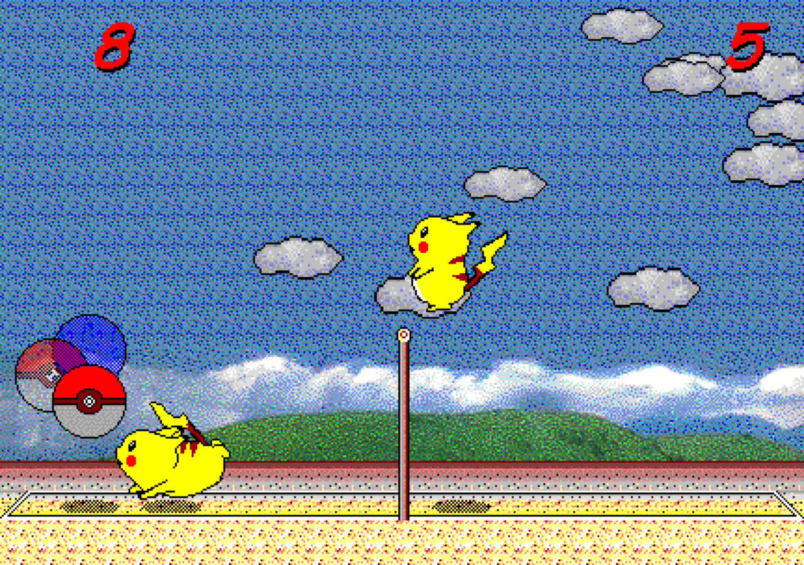

## 피카츄 배구

[_English_](README.md) | _&check;_ _Korean(한국어)_

피카츄 배구(対戦ぴかちゅ～　ﾋﾞｰﾁﾊﾞﾚｰ編)는 "(C) SACHI SOFT / SAWAYAKAN Programmers"와 "(C) Satoshi Takenouchi"가 1997년에 만든 윈도우용 게임입니다. 여기에 있는 소스 코드는 이 원조 피카츄 배구 게임의 머신 코드 주요 부분(물리 엔진과 AI 등)을 리버스 엔지니어링하여 자바스크립트로 구현한 것입니다.

https://gorisanson.github.io/pikachu-volleyball/ko/ 에서 피카츄 배구를 플레이할 수 있습니다. 피카츄 배구 서브 인코더는 위의 코드를 기반으로 작성되었습니다.



## 로컬 환경에서 실행하는 방법

1. 본 저장소를 클론하고 해당 디렉토리로 들어갑니다.

```sh
git clone https://github.com/uzaramen108/pikaserve-encoder.git
cd pikaserve-encoder
```

2. 의존하는 패키지를 설치합니다. (오류가 발생한다면, `node v16`와 `npm v8`을 사용해보세요.)

```sh
npm install
```

3. 코드를 번들링 합니다.

```sh
npm run build
```

4. 로컬 웹 서버를 실행합니다.

```sh
npx http-server dist
```

5. 웹 브라우저에서 로컬 웹 서버로 접속합니다. (대부분의 경우, 서버에 접속하기 위한 URL은 `http://localhost:8080` 입니다. 정확한 URL은 터미널에 출력된 메시지에서 확인할 수 있습니다.)

## 기존 오프라인 피카츄 배구에 대한 변경점

- '혼자서 함께' 선택 시 z와 Enter에 따라 1p와 2p로 플레이할지 결정되며 플레이어는 1p와 2p 방향키 모두를 사용 가능합니다.
- '혼자서 함께' 선택 시 AI는 움직이지 않으며 공과 충돌하지 않습니다.
- 플레이어가 득점 및 실점하여도 점수는 0 : 0 그대로이며 서브는 플레이어가 계속 진행합니다.
- 화면이 Fade-out 된 후 서브 코드가 업데이트되며 '복사' 버튼을 통해 서브 코드를 복사할 수 있습니다(복사한 서브 코드는 https://ilesejin.github.io/pikachuserver의 어플을 통해 시뮬레이션 가능합니다)
